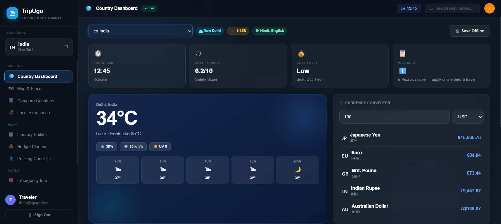
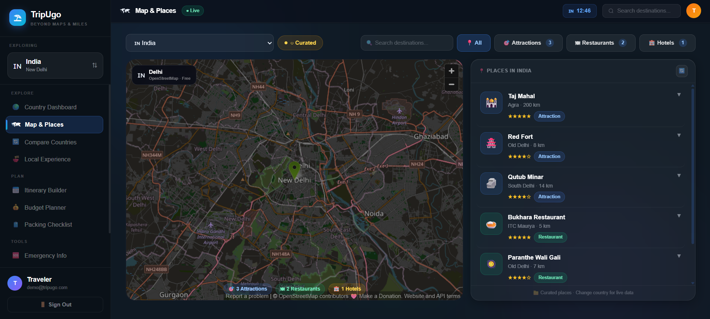
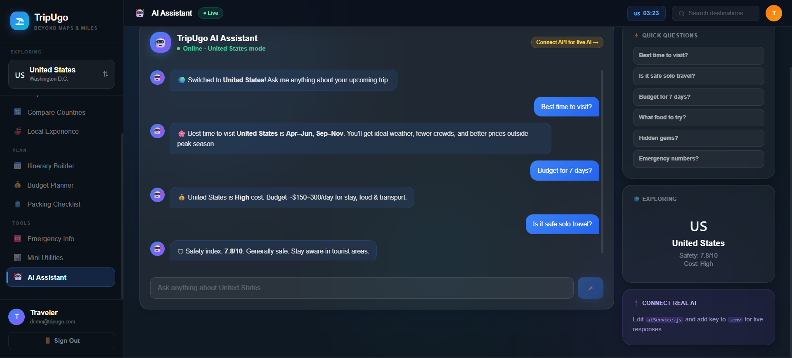
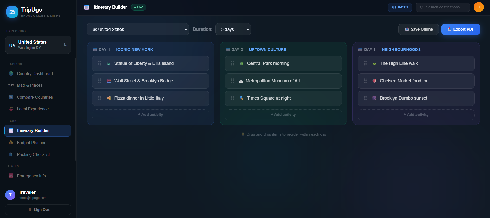
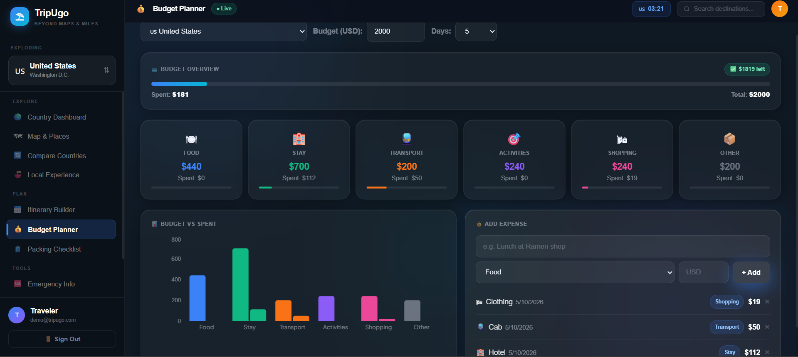
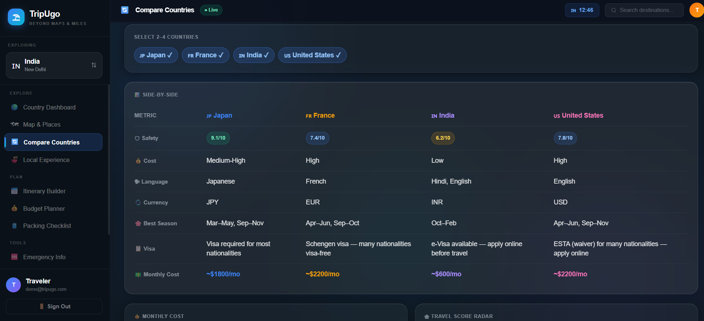
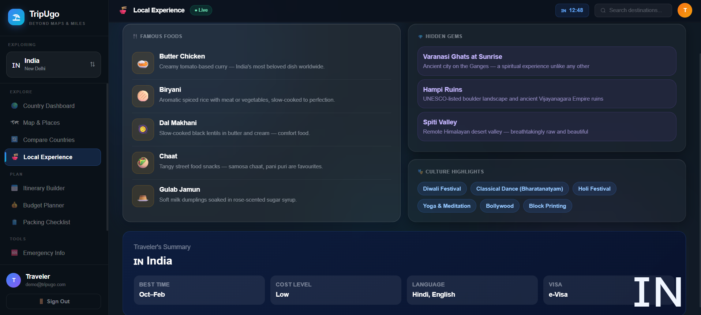
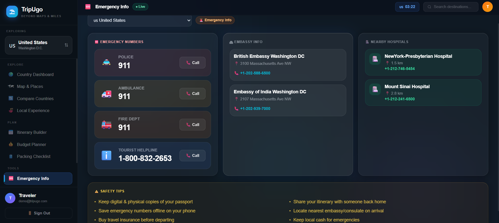
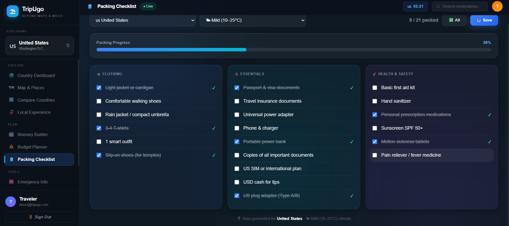
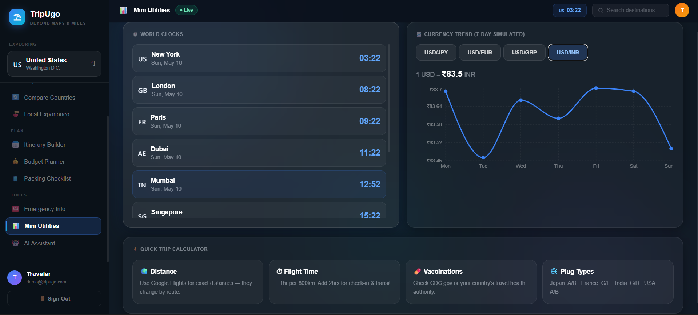

# ⛱ TripUgo — Beyond Maps & Miles

<p align="center">
  <strong>Plan smarter. Travel better.</strong><br/>
  An all-in-one smart travel platform designed to simplify trip planning, exploration, budgeting, weather insights, and travel utilities in one seamless experience.
</p>

<p align="center">


</p>

# ✨ Features

TripUgo is a modern smart travel platform built to make travel planning effortless.

### 🗺️ Smart Maps & Places
- Interactive maps using **OpenStreetMap + Leaflet**
- Live attractions, restaurants, and hotel discovery
- Country-wise location exploration
- Dynamic place markers and details

### 🌦️ Real-Time Weather
- Live weather data using **OpenWeather API**
- Forecast information
- Travel-friendly weather insights

### 💱 Currency Conversion
- Real-time exchange rates
- Multi-country travel planning support
- Smart currency utilities

### 🌍 Country Explorer
- Explore countries and locations
- Travel-related country information
- Smart comparison between destinations

### 🧳 Itinerary Builder
- Plan travel schedules
- Organize trip flow
- Better travel management

### 💰 Budget Planner
- Expense planning for trips
- Budget estimation
- Smarter spending decisions

### 🤖 AI Travel Assistant *(Mock Version)*
- Smart travel assistant UI
- Travel recommendation simulation
- Future-ready AI integration structure

### 🛠️ Travel Utilities
- Emergency information
- Packing checklist
- Helpful travel tools

### 🔐 Authentication UI
- Beautiful login/register experience
- Modern responsive auth interface

---

# 🖼️ Screenshots

## 🔐 Authentication Page


---

## 🏠 Dashboard



---

## 🗺️ Map & Places



---

## 🤖 AI Assistant



---

## 🧳 Itinerary Planner



---

## 💰 Budget Planner



---

## 🌍 Compare Countries



---

## 🏕️ Local Experience



---

## 🚨 Emergency Information



---

## ✅ Packing Checklist



---

## 🛠️ Utilities



# 🏗️ Tech Stack

## Frontend
- React.js
- Vite
- JavaScript (ES6+)
- Tailwind CSS
- Framer Motion

## Maps & Location
- Leaflet
- React Leaflet
- OpenStreetMap
- Overpass API
- Nominatim API

## APIs
- OpenWeather API
- Exchange Rate API

## Deployment
- Vercel

# 📁 Project Structure

```bash
TripUgo/
│── dist/                     # Production build files
│── node_modules/             # Installed dependencies
│── public/
│   └── travel-bg.mp4         # Background travel video
│
│── screenshots/              # README screenshots
│
│── src/
│   ├── components/
│   │   ├── layout/           # Shared layout components
│   │   │   ├── Layout.jsx
│   │   │   ├── Sidebar.jsx
│   │   │   └── Topbar.jsx
│   │   │
│   │   └── ui/               # Reusable UI components
│   │       ├── CountrySelector.jsx
│   │       └── Skeleton.jsx
│   │
│   ├── context/              # Global state management
│   │   ├── AppContext.jsx
│   │   └── AuthContext.jsx
│   │
│   ├── data/                 # Static application data
│   │   ├── countries.json
│   │   └── packingRules.json
│   │
│   ├── hooks/                # Custom React hooks
│   │   ├── useCurrency.js
│   │   └── useWeather.js
│   │
│   ├── pages/                # Application pages/routes
│   │   ├── AuthPage.jsx
│   │   ├── DashboardPage.jsx
│   │   ├── MapPage.jsx
│   │   ├── ComparePage.jsx
│   │   ├── BudgetPage.jsx
│   │   ├── ItineraryPage.jsx
│   │   ├── LocalPage.jsx
│   │   ├── EmergencyPage.jsx
│   │   ├── UtilitiesPage.jsx
│   │   ├── PackingPage.jsx
│   │   ├── AssistantPage.jsx
│   │   └── NotFound.jsx
│   │
│   ├── services/             # API service logic
│   │   ├── currencyService.js
│   │   └── weatherService.js
│   │
│   ├── utils/                # Helper utilities
│   │   └── formatters.js
│   │
│   ├── App.jsx               # Main app routes
│   ├── index.css             # Global styles
│   └── main.jsx              # App entry point
│
│── .env                      # Environment variables
│── .gitignore
│── README.md
│── vercel.json               # Vercel SPA routing config
│── vite.config.js
│── tailwind.config.js
│── postcss.config.js
│── package.json
│── package-lock.json
```
# ⚙️ Environment Variables

Create a `.env` file in root directory:

```env
VITE_OPENWEATHER_KEY=your_weather_api_key
VITE_EXCHANGE_KEY=your_exchange_api_key
```

# 🧑‍💻 Installation & Setup

## Clone Repository

```bash
git clone https://github.com/rajmanvi17/TripUgo.git
```

## Navigate to Project

```bash
cd TripUgo
```

## Install Dependencies

```bash
npm install
```

## Run Development Server

```bash
npm run dev
```

Runs on:

```txt
http://localhost:5173
```

# 🏭 Production Build

Build project:

```bash
npm run build
```

Preview build:

```bash
npm run preview
```

# 🌐 Deployment

Live Website:

https://tripugo.vercel.app/

GitHub Repository:

https://github.com/rajmanvi17/TripUgo

Hosted on **Vercel**.

Auto deployment is enabled via GitHub integration.

# 🔄 Routing Support

TripUgo uses **React Router DOM** for client-side routing.

To support direct refresh on nested routes during production deployment on **Vercel**, a rewrite configuration is added.

### `vercel.json`

```json
{
  "rewrites": [
    {
      "source": "/(.*)",
      "destination": "/index.html"
    }
  ]
}
```

This ensures routes such as:

```txt
/dashboard
/map
/budget
/compare
```

work correctly after browser refresh without returning a `404 Not Found` error.

---
# 🧠 Architecture Highlights

TripUgo follows a **modular and scalable frontend architecture** for maintainability and production readiness.

### 🧩 Component-Based Architecture

The project is divided into reusable modules:

#### Layout Components
Reusable shared layout system:

- `Sidebar.jsx`
- `Topbar.jsx`
- `Layout.jsx`

Provides a consistent navigation and UI structure across all pages.

---

### 🎨 Reusable UI Components

Generic reusable UI elements:

- `CountrySelector.jsx`
- `Skeleton.jsx`

This improves code reusability and cleaner UI logic.

---

### 🌍 Context-Based State Management

Global application state is handled using:

#### `AppContext`
Manages:
- selected country
- shared app state
- travel-related global data

#### `AuthContext`
Manages:
- authentication state
- login/logout flow
- protected access logic

---

### 📄 Page-Based Routing

TripUgo uses **React Router DOM** with dedicated pages:

- Authentication
- Dashboard
- Maps & Places
- Country Comparison
- Budget Planning
- Itinerary Builder
- Local Experience
- Emergency Info
- Utilities
- Packing Checklist
- AI Assistant

This keeps routing modular and scalable.

---

### 🔌 Service Layer Architecture

API logic is separated from UI using service files.

#### `weatherService.js`
Handles:
- OpenWeather API
- weather caching
- fallback logic

#### `currencyService.js`
Handles:
- exchange rate APIs
- cached currency conversion

This improves maintainability and API abstraction.

---

### 🪝 Custom Hooks

Reusable business logic via hooks:

#### `useWeather.js`
- weather fetching
- state handling
- reusable weather logic

#### `useCurrency.js`
- currency fetching
- conversion state logic

---

### 📦 Utility Layer

Utility helpers:

#### `formatters.js`
Handles:
- formatting helpers
- reusable utility functions

---

### ⚡ Performance Optimizations

Implemented optimizations:

- API caching
- minimized unnecessary API calls
- request timeout handling
- fallback API support
- lightweight reusable components
- SPA routing optimization for Vercel

---

# 🚧 Challenges Solved

### 🌍 Public API Rate Limiting

Since free public map APIs can face request limitations:

```txt
429 Too Many Requests
504 Gateway Timeout
```

TripUgo handles failures using:

- API fallback servers
- Timeout protection
- Reduced API spam
- Optimized request flow

---

### ⚡ Single Page Application Routing

A common Vercel issue:

```txt
404 Not Found
```

on page refresh for nested routes was solved using:

```json
vercel.json rewrites
```

---

### 🗺️ Free Maps Integration

Implemented a production-friendly map experience using:

- OpenStreetMap
- Overpass API
- Nominatim API

without paid Google Maps dependency.

---

# 🔮 Future Improvements

Planned upgrades for upcoming versions of **TripUgo**:

### 🤖 Smart Travel Enhancements
- Real AI Travel Assistant Integration
- Personalized travel recommendations
- Smart itinerary suggestions
- Context-aware travel assistance

### 🌐 Travel Intelligence
- 📰 **Latest Travel & Tourism News**
  - Tourism updates
  - New travel laws & regulations
  - Visa policy updates
  - Safety advisories
  - Country-specific travel alerts

### 🗣️ Language & Communication Support
- 🔊 **Audio Voice Support for Basic Phrases**
  - Country-wise common travel phrases
  - Native pronunciation playback
  - Emergency phrases
  - Greetings and local communication help

### ✈️ Travel Ecosystem
- Flight Booking APIs
- Hotel Booking APIs
- Saved itineraries
- Favorite destinations
- Smart travel notifications

### 👤 User Experience
- Backend authentication
- User profiles
- Cloud-synced travel history
- GPS-based recommendations
- Offline travel essentials

---

# 🤝 Contributing

Contributions, suggestions, and feature ideas are welcome.

If you'd like to contribute:

1. Fork the repository
2. Create a new branch

```bash
git checkout -b feature-name
```

3. Make changes
4. Commit your work

```bash
git commit -m "Added new feature"
```

5. Push your branch

```bash
git push origin feature-name
```

6. Open a Pull Request 🚀

---
# 👩‍💻 Author

### **Manvi Raj**

Passionate about building smart, scalable, and impactful web experiences through modern frontend development.

---

## 🌐 Let's Connect

🔗 **GitHub**  
https://github.com/rajmanvi17

💼 **LinkedIn**  
https://www.linkedin.com/in/%20manvi-raj-593747274

✍️ **Medium**  
https://medium.com/@manvi.raj60

🌍 **Live Project**  
https://tripugo.vercel.app/

💡 Open to collaboration, frontend opportunities, and impactful projects.

---
# ⭐ Feedback & Support

If you found **TripUgo** useful or interesting:

⭐ **Star this repository**  
📝 Share feedback or suggestions  
🐛 Report bugs or improvements via issues

Your support and feedback help improve the project.

---

## 💬 Rate This Project

If you liked the UI, features, or idea behind TripUgo, consider giving it a ⭐ on GitHub.

<p align="center">
Made with 🩵 by <strong>Manvi Raj</strong>
</p>